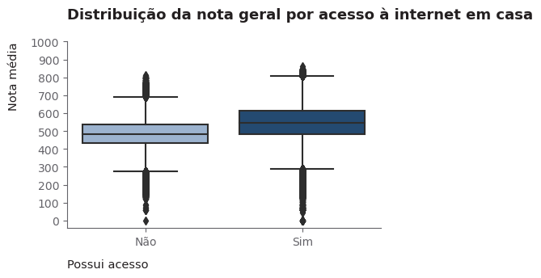

# Análise e Modelagem dos Microdados do ENEM 2023

# 1. Descrição e objetivos
- Este é um projeto de ciência de dados em que é realizada a limpeza, análise exploratória e modelagem dos microdados do enem 2023 (dados públicos reais).
- A solução foi planejada com base no framework CRISP-DM, envolvendo o entendimento do problema, entendimento dos dados, limpeza dos dados, análise dos dados e modelagem.
- A limpeza foi fundamental, dado que o conjunto original dos microdados tem mais de 2 GB de tamanho, tornando a manipulação, análise e modelagem dos dados inviável.
- A análise e modelagem se dividem em duas abordagens:
    - Análise de desempenho: O objetivo dessa análise consiste em identificar as principais variáveis que impactam a nota do candidato e como elas se relacionam com o desempenho dele.
    - Análise e modelagem de abstenção: O objetivo dessa análise consiste em identificar os principais fatores que influenciam a ausência do candidato na prova. Além disso, observar como esses fatores se relacionam com a ausência e como eles podem ser utilizados para a predição da probabilidade de abstenção do estudante. 
    - Na modelagem de abstenção foi utilizado o modelo LightGBM, dado o alto poder preditivo, rapidez de treinamento e predição, e flexibilidade no pré-processamento.
- Tais análises podem servir para interesses educacionais. O governo poderia utilizá-las para, por exemplo:
    - A partir do conhecimento dos fatores que mais influenciam a abstenção do candidato e das probabilidades de ausência preditas, determinar intervenções preventivas, aprimoramento da comunicação e planejamento estratégico de forma a mitigar essa alta taxa de abstenção em pontos de foco e, consequentemente, melhorar a qualidade do exame e da educação do país.
    - A partir do conhecimento dos fatores que mais impactam a nota do candidato, identificar talentos potenciais (perfis de alunos que tendem a performar excepcionalmente no enem) e necessidades individuais (perfis de alunos que tendem a performar mal no enem), avaliar o desempenho educacional e realizar um planejamento estratégico para assistir àqueles menos capacitados. Consequentemente, isso melhoraria a qualidade do exame e da educação do país.
- As análises e a modelagem realizada são abordadas com mais detalhes nos próximos tópicos.

# 2. Limpeza de dados
- A limpeza foi fundamental, dado que o conjunto original dos microdados tem mais de 2 GB de tamanho, tornando a manipulação, análise e modelagem dos dados inviável. Nessa etapa, foram realizadas as seguintes tarefas:
    - Identificação e tratamento de valores nulos e duplicados, de acordo com os objetivos da análise.
    - Remoção de variáveis irrelevantes para a análise. Variáveis com alto percentual de valores nulos, variáveis com variância constante, variáveis com alta cardinalidade, variáveis com um valor por registro, variáveis inúteis.
    - Feature engineering: Criação e alteração de variáveis existentes. Fusão, remoção e renomeação de categorias com base na melhor formatação para os objetivos propostos. Além disso, conversão colunas para o tipo de dado correto.
    - Otimização de memória: Conversão de variáveis a tipos de dados menores, a fim de melhorar a performance, possibilitando a leitura e manipulação dos dados em menor tempo, sem que haja a perda de informação. Colunas 'object' foram convertidas a 'category', colunas 'float64' foram convertidas a 'float32' e colunas 'int64' foram convertidas a 'int8'.
    - Tudo foi salvo em um arquivo parquet, de forma a agilizar a leitura e manter os tipos convertidos do tópico acima.
- Como resultado da limpeza, foi possível reduzir o tamanho do dataset de +2 GB para +243.4 MB, quase 10%!
- [Clique aqui para acessar a limpeza de dados](https://github.com/allmeidaapedro/Enem-Modeling-TCC/blob/main/notebooks/1_data_cleaning.ipynb)

# 3. Análise de desempenho
- O objetivo dessa análise consiste em identificar as principais variáveis que impactam a nota do candidato e como elas se relacionam com o desempenho dele.
- Uma observação importante é que, dado que alunos ausentes ficam com nota nula, a amostra selecionada para essa análise consiste apenas de candidatos que compareceram em ambos os dias do enem. Introduzir ausentes incluiria assimetrias e distorções no estudo em questão.
- Perguntas respondidas na Análise de Desempenho:
    - Existem diferenças no desempenho para pessoas de diferentes faixas etárias?
    - Em média, quais os estados com as maiores e as menores notas gerais?
    - Como a renda influencia o desempenho do candidato?
    - Como a escolaridade do pai e da mãe influenciam a nota geral do candidato?
    - Como a ocupação do pai e da mãe influenciam a nota geral do candidato?
    - De que forma a falta de acesso a recursos tecnológicos (celular, computador e internet) em casa impactam o desempenho do candidato?
    - De que forma o tipo de escola (pública ou privada) influencia o desempenho do candidato?
    - Existe alguma correlação entre o número de pessoas em casa e a nota geral do candidato?
- [Clique aqui para acessar a análise de desempenho](https://github.com/allmeidaapedro/Enem-Modeling-TCC/blob/main/notebooks/2_eda.ipynb)

# 3.1 Principais insights - Análise de desempenho
- A nota média geral no enem de 2023 é aproximadamente 540. 
- A nota média máxima no ENEM de 2023 é aproximadamente 862.
- Ciências da natureza é a área do conhecimento com o pior desempenho. A nota média é aproximadamente 496. Além disso, analisando os percentis, metade dos candidatos obtém uma nota de até 494 nessa prova. Esse resultado é bem baixo, principalmente se comparado com a área do conhecimento com o melhor desempenho, matemática. A nota média nela é aproximadamente 534. Uma observação importante é que esse indicador em matemática pode enganar. Apesar de ter a maior nota média, isso se deve ao modelo do enem, que naturalmente atribui mais pontos para essa prova.

- Surpreendentemente, 48% dos candidatos não possuem computador em casa. Esse dado nos revela uma dificuldade e disparidade de condições dos estudantes, já que um computador com acesso a internet é a melhor ferramenta para estudos atualmente.
- 91.7% dos candidatos possuem acesso a internet em casa. Embora seja um baixo percentual, ainda é alarmante o fato de que aproximadamente 8% dos estudantes não possuem sequer internet para se preparar. Considerando um exame desse porte, isso representa um grande número de pessoas.

- Candidatos com um ou mais computadores em casa tendem a obter uma nota geral maior que aqueles que não possuem o dispositivo.
- Candidatos com acesso a internet em casa tendem a obter uma nota geral maior que aqueles que não possuem o recurso.

- Claramente, quanto maior a escolaridade do pai ou da mãe, melhor o desempenho do candidato.

- É possível perceber que, em média, quanto maior a renda familiar mensal, maior a nota geral do candidato. Candidatos com renda acima de R$ 26.400,00 obtiveram uma nota geral média 1.35 vezes maior que candidatos com nenhuma renda, totalizando uma diferença absoluta de aproximadamente 166 pontos.

- Em média, alunos de escola privada obtêm uma nota média 100 pontos acima que a de alunos de escola pública.

# 4. Análise de abstenção
- O objetivo dessa análise consiste em identificar os principais fatores que influenciam a ausência do candidato na prova. Além disso, observar como esses fatores se relacionam com a ausência e como podem ser utilizados para a predição da probabilidade de abstenção do estudante.
- Para essa análise, foi utilizado todo o conjunto de dados. Dessa forma, incluimos não só os estudantes que compareceram, mas também aqueles que faltaram ao exame, os quais são o nosso alvo.
- Principais perguntas respondidas na Análise de Abstenção:
    - A falta de acesso a recursos tecnológicos (celular, computador e internet) em casa influenciam a ausência do candidato na prova?
    - A escolaridade do pai e da mãe influenciam a ausência do candidato na prova?
    - A renda familiar mensal influencia a ausência do candidato na prova?
    - Existe alguma diferença na taxa de abstenção entre as diferentes faixas etárias?
    - Quais regiões apresentam as maiores e as menores taxas de abstenção?
    - Existe alguma diferença na taxa de abstenção entre alunos de escola pública e privada?
    - A ocupação do pai e da mãe influenciam a ausência do candidato na prova?
- [Clique aqui para acessar a análise de abstenção](https://github.com/allmeidaapedro/Enem-Modeling-TCC/blob/main/notebooks/2_eda.ipynb)

# 4.1 Principais insights - Análise de abstenção
- Ambos os dias de prova apresentam altas taxas de abstenção. Para o primeiro dia (provas de linguagens e ciências humanas) temos uma taxa de aproximadamente 28%, contra 32% para o segundo dia (ciências da natureza e matemática). Isso é preocupante, principalmente porque a enorme maioria dessas ausências não se devem a razões randômicas, mas sim por falta de preparo/confiança do candidato para realizar a prova. O governo deve trabalhar para mitigar essa problemática.

- A escolaridade do pai e/ou da mãe influenciam a ausência do candidato na prova. Claramente, à medida que o nível de escolaridade aumenta, a taxa de abstenção cai. Por exemplo, analisando a escolaridade da mãe, é possível perceber que a proporção de ausentes entre candidatos cujas mães nunca estudaram é quase três vezes a taxa para aqueles cujas mães possuem pós graduação.

- A renda familiar mensal influencia a ausência do candidato na prova. Claramente, à medida que a renda aumenta, a taxa de abstenção cai. Por exemplo, a proporção de ausentes entre candidatos que não possuem nenhuma renda é mais que o dobro da taxa entre aqueles que possuem rendas maiores que 5 mil reais.

- A taxa de abstenção para alunos de escola pública é 5 vezes maior que a de alunos de escola privada.

# 5. Modelagem de abstenção
- Para a predição da probabilidade de abstenção, foi utilizado o modelo LightGBM por conta do seu poder preditivo, rápido treinamento e predição e flexibilidade de pré-processamento.
- Feature engineering: Criei o target (flag indicando se o aluno faltou em qualquer um dos dias de prova), removi variáveis irrelevantes e variáveis que levariam a data leakage (notas por exemplo). Além disso, fundi categorias com base nas taxas de abstenção e nas proporções dentro da respectiva coluna. Criei variáveis que indicavam qual a região do candidato, indicadores de acesso tecnológico que ele tem em casa, conforto, renda por pessoa, entre outros indicadores e atividades. Foi realizado um extenso trabalho de feature engineering, uma vez que este é o mais impactante na performance final do modelo. Ao final, foram construídas cerca de 71 features.
- Feature selection: Após a feature engineering, foi realizado um processo de feature selection, a fim de prosseguir com os melhores indicadores preditivos e testar vários modelos. Foi utilizado um pipeline robusto e relativamente agnóstico a um modelo específico. Removeu-se variáveis com alto percentual de nulos, removeu-se variáveis altamente correlacionadas entre si (redundantes), removeu-se variáveis com variância zero (não informativas), e removeu-se variáveis com com feature importance menor que zero. Finalmente, foram selecionadas, dentre as restantes, aquelas com feature importance maior que a mediana.
- Após a feature selection, avaliei através da validação cruzada k-fold estratificada modelos potenciais, a fim de selecionar um deles para a tunagem de hiperparâmetros e avaliação final no conjunto de testes. O modelo selecionado foi o LightGBM, pois obteve o menor erro de validação e o melhor ajuste no conjunto de treinamento.
- Pré-processamento: 
    - Variáveis numéricas: Modelos baseados em árvore (como é o caso do LightGBM escolhido) não requerem o escalonamento das características. Portanto, não apliquei nenhum tipo de pré-processamento a variáveis numéricas.
    - Variáveis categóricas: Dado que o OneHotEncoder pode ser prejudicial para modelos baseados em árvore (por conta da representação esparsa), apliquei o TargetEncoder a variáveis categóricas nominais. Para variáveis com relação binária natural, foi aplicado o one hot encoding, não prejudicando esses modelos, criando uma única feature. Para as que possuem relação ordinal, utilizei o OrdinalEncoder, a fim de manter esse comportamento ordenado.
    - O LightGBM lida nativamente com valores nulos, portanto, não foi preciso nem mesmo se preocupar com eles.
- Tunagem de hiperparâmetros: O modelo escolhido foi tunado através da busca bayesiana, pois ela traz um balanço para o trade-off exploration-exploitation, realizando uma busca eficiente no espaço de hiperparâmetros. Foi utilizada a biblioteca optuna para isto.
- Calibração de probabilidades: Uma vez que queremos probabilidades realistas confiáveis de o candidato se abster em pelo menos um dos dois dias de prova do enem, realizei a calibração das probabilidades do modelo LightGBM final. Isso é necessário pois modelos baseados em árvore, como o LightGBM, ao contrário de uma Regressão Logística, por exemplo, não fornecem probabilidades realistas, mas sim infladas. Dessa forma, é necessário realizar a calibração, para que por exemplo, se o modelo prevê que 10 indivíduos têm 40% de probabilidade de abstenção, 4 deles sejam de fato positivos para ausência em pelo menos um dos dias de prova. Para atingir essa calibração, apliquei uma Isotonic Regression sobre o LightGBM final utilizando o conjunto de validação, avaliando o Brier Score e sua redução e as curvas de calibração.
- Em suma, considerando que trata-se de uma classificação binária desbalanceada (temos aproximadamente 32% de ausentes contra 68% de presentes), as estratégias adotadas para lidar com esse problema foram:
    - Feature engineering para ajudar o modelo a discriminar entre abstenção (1) e presença (0).
    - Divisão ESTRATIFICADA em treino, teste e validação, para manter a proporção das classes positiva e negativa do target em todas as amostras, permitindo uma avaliação confiável.
    - Validação cruzada k-fold ESTRATIFICADA pelo mesmo motivo, a fim de selecionar o melhor modelo potencial para tunagem de hiperparâmetros com busca bayesiana.
    - Escolha de métricas orientadas a uma avaliação de performance condizente com o desbalanceamento, como KS e ROC-AUC.
- Avaliando o modelo final no conjunto de testes (dados nunca antes vistos, simulando o ambiente de produção), o resultado obtido foi satisfatório, apesar de haver espaço para melhorias. Obtivemos um ROC AUC de 0.70, indicando que o modelo possui um poder discriminante satisfatório entre as classes positiva e negativa. Isso indica que, se tomarmos ao acaso um candidato ausente e um presente, em 70% das vezes o modelo estima uma probabilidade de abstenção maior para aquele que de fato se absteve. O modelo apresenta ordenação nos escores, com faixas de probabilidade mais altas contendo mais ausentes. Outrossim, os scores nas amostras de treino, teste e validação são similares, indicando que o modelo não está com overfit e generaliza de forma satisfatória para instâncias nunca antes vistas.
- Os resultados foram interpretados através da biblioteca SHAP, fornecendo uma visão do impacto de cada variável nas predições individuais e a sua importância agregada através dos SHAP values. Por exemplo, através do gráfico beeswarm vemos que:
    - Claramente, candidatos que já concluiram o ensino médio, em estágio mais avançado nesse quesito, impactam de forma positiva (em maior magnitude) as predições do modelo. Isso significa um aumento na log-odds e, consequentemente, na probabilidade de abstenção. Isso é reforçado pela variável ano_concluiu.
    - O contrário é verdade para o número de celulares e computadores em casa. A separação é clara, quanto menor for o número, maior a probabilidade de abstenção e vice-versa. O mesmo vale para a escolaridade da mãe e do pai.
    - Para o tipo de escola, temos uma clara separação. Valores menores, que correspondem a escola particular, impactam de forma negativa (em maior magnitude) as predições do modelo. Isso significa uma diminuição na log-odds e, consequentemente, na probabilidade de abstenção.
    - Para renda, menores valores acarretam um aumento na log-odds e na probabilidade de abstenção.
    - Todas as interpretações condizem com a lógica e os insights da análise exploratória, provando que o modelo toma decisões de acordo com a realidade e não de forma aleatória.

- [Clique aqui para acessar a modelagem de abstenção](https://github.com/allmeidaapedro/Enem-Modeling-TCC/blob/main/notebooks/3_modeling_abstencao.ipynb)

| Model   | Accuracy | Precision | Recall   | F1-Score | ROC-AUC  | KS       | Gini     | PR-AUC   | Brier    |
|---------|----------|-----------|----------|----------|----------|----------|----------|----------|----------|
| LightGBM| 0.695979 | 0.542494  | 0.280838 | 0.370089 | 0.704071 | 0.300904 | 0.408142 | 0.491343 | 0.193333 |

# 6. Estrutura de pastas do projeto
- Input: Contém o produto da limpeza de dados, o arquivo clean_df.parquet, utilizado como dado bruto em todos os notebooks e arquivos do projeto. Além dos arquivos fonte com os microdados do enem (link para download).
- Notebooks: Contém os notebooks de limpeza de dados, análise exploratória de dados (desempenho e abstenção) e modelagem de abstenção.
- Reports: Contém imagens para documentação.
- Src: Contém todos os scripts .py, incluindo utils, exceções e logger.
- requirements.txt: Arquivo contendo as dependências do projeto e suas respectivas versões para reprodutibilidade.

# 7. Tecnologias utilizadas
- As tecnologias e ferramentas utilizadas foram Python (Pandas, Numpy, Matplotlib, Seaborn, Scikit-Learn, Optuna), Jupyter Notebook, Git e Github (controle de versão), algoritmos de machine learning para classificação, estatística, UV (isolamento e gestão de dependências) e Visual Studio Code (ambiente de desenvolvimento do projeto).

# 8. Execute o projeto na sua máquina
- Pré-requisitos:

- Antes de começar, certifique-se de ter os seguintes itens instalados em sua máquina:

    - Python 3.13
    - pip (gerenciador de pacotes Python)
    - Git (ferramenta de controle de versão)

- Após instalar esses requisitos, abra um terminal em sua máquina local e execute os seguintes comandos:

1. Clonar o repositório:
<pre>
git clone https://github.com/allmeidaapedro/Enem-Modeling-TCC.git
</pre>

2. Navegar até o diretório do repositório clonado:
<pre>
cd Enem-Modeling-TCC
</pre>

3. Criar um ambiente virtual:
<pre>
python -m venv venv
</pre>

4. Ativar o Ambiente Virtual:
- Ative o ambiente virtual usado para isolar as dependências do projeto.
<pre>
source venv/bin/activate  # No Windows, use 'venv\Scripts\activate'
</pre>

5. Instalar Dependências:
- Use o pip para instalar as dependências necessárias listadas no arquivo requirements.txt.
<pre>
pip install -r requirements.txt
</pre>

6. Execute os notebooks na pasta 'notebooks'

7. Desativar o Ambiente Virtual:
- Quando terminar com o projeto, desative o ambiente virtual.
<pre>
deactivate
</pre>

# 9. Acesso aos dados
- Os dados podem ser encontrados em: https://download.inep.gov.br/microdados/microdados_enem_2023.zip

# 10. Contato
- Linkedin: https://www.linkedin.com/in/pedro-almeida-ds/
- Github: https://github.com/allmeidaapedro
- Gmail: pedrooalmeida.net@gmail.com